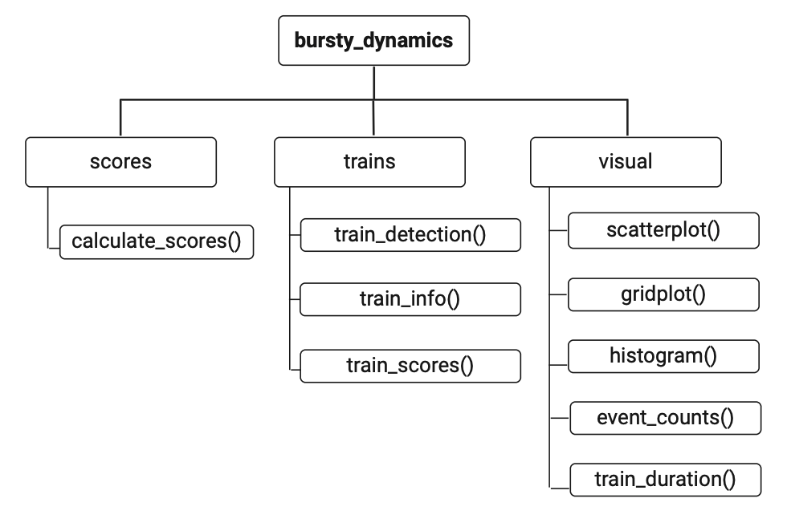
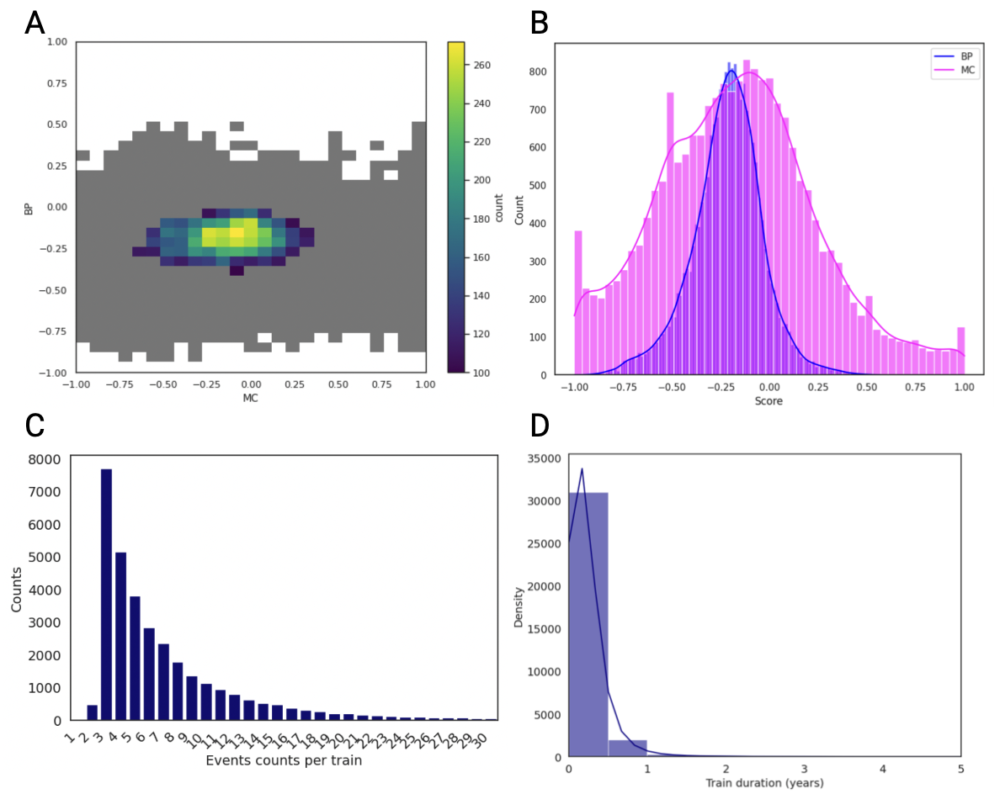

# Summary

Understanding the temporal properties of longitudinal data is critical for identifying trends, predicting future events, and making informed decisions in any field where temporal data is analysed, including health epidemiology, finance, and the geo- and social sciences. This paper introduces a Python package designed to quantify bursty dynamics in temporal data. This is defined using the burstiness parameter (BP) (Kim and Jo, 2016) and memory coefficient (MC) (Goh and Barabási, 2008). BP and MC provide insights into the irregularity and predictability of events over time. An event train detection method is also implemented to identify groups of events occurring within a specified time interval. The package requires input data with subject identifiers and event time information, and it provides functionalities for BP and MC calculation, event train detection and detailed analysis of identified trains. Additionally, the package offers visualisation tools, including scatter plots, histograms, and kernel density estimates, to aid in the interpretation of the temporal data. This paper outlines the methods and functionality of version 0.1.0 of the ‘bursty_dynamics’ Python package, highlighting its potential applications in various research domains.

# Statement of need

Longitudinal data, characterised by repeated observations of the same subjects over time, is prevalent in various disciplines. Analysing the temporal dynamics of such data can reveal significant patterns and trends. Throughout this paper, we refer to an ‘event’ as a record in the data that includes a timestamp. Traditional time-series analysis methods often fall short in capturing the complexity of temporal properties in longitudinal data, which may be linked to the aetiology of events. Therefore, metrics like the BP and MC have been developed to address this challenge. The BP quantifies the degree of irregularity in the timing of events, while the MC measures the temporal dependency between successive events. Together, these metrics offer characterisation of the temporal properties of longitudinal data, and may detect intrinsic features, such as self-exciting events. We recommend the use of event trains for burstiness analysis, to enhance focus, reduce noise, and improve the accuracy and relevance of insights compared to analysis of entire time courses.  This package aims to provide analytical tools for effectively quantifying and visualising the complexity of temporal events, with simplified computation and visualisation of bursty dynamics in longitudinal data. The package is designed to be user-friendly, flexible, and comprehensive, catering to researchers who need to analyse and interpret the temporal properties of their longitudinal datasets.

# Overview

Users can install the package to a local Python environment. Once installed, the package provides various functions for analysing temporal properties of longitudinal data directly from the command-line interface or any Python integrated development environment (IDE). Users start by loading their longitudinal data into a DataFrame and using the provided functions to analyse and visualise the temporal patterns.  Figure 1 shows the structure of the package. A Jupyter notebook with a working example is available Here.

{width=85%}

The input DataFrame must contain the 'subject_id' and 'time_col' columns (Table 1). The ‘subject_id’ column should include unique identifiers for each subject in the dataset. The 'time_col' column should contain either date or date and time values in a format that is compatible with Python’s Pandas function ‘pandas.to_datetime'.

| subject_id | time_col   |
|------------|------------|
| 1          | 2020-01-01 |
| 1          | 2020-02-01 |
| 2          | 2000-05-01 |

*Table 1: An example of how the input data should be formatted.*

## 1. Calculation of Burstiness Parameter and Memory Coefficient
Users can calculate BP and MC by passing a DataFrame with subject IDs and event dates to the `calculate_scores` function. The package allows optional plotting of scatter plots and histograms for visual analysis. 

## 2. Event Train Detection
Taking inspiration from Corner et al. (2002), we have implemented a method to identify clusters of events, denoted here as ‘train detection’. We recommend the detection of event trains prior to burstiness analysis. The `train_detection` function detects and assigns train IDs to events based on the specified parameters such as maximum inter-event time and minimum number of events to form a train. This threshold, the maximum inter-event time, acts as a decisive cut-off point, determining whether two events are close enough in time to be considered part of a series of events with likely shared aetiology. If the interval between two successive events exceeds this threshold, the following event is not included, and the train of events is deemed to have ended. This flexibility allows for tailored analysis suited to specific research questions. By adjusting parameters and re-running analyses, users can iteratively explore their data, refine their understanding of temporal patterns, and identify meaningful insights.

## 3. Analysis of Detected Trains
The package extends the analysis of the detected trains by calculating BP and MC for each train within each subject's data. The train-level analysis helps to identify patterns within clusters of events, offering deeper insights into the temporal dynamics.

## 4. Summary Statistics for Trains
To provide a comprehensive overview of the detected trains, the package includes a function to calculate summary statistics. This feature aggregates information on train properties, such as the number of events per train and train durations, enabling a more detailed understanding of the event sequences.

## 5. Visualisation Tools

{width=85%}

The package includes various visualisation tools to aid in the interpretation of the calculated metrics and detected trains:  
• Grid Plot: Visualise the relationship between MC and BP with a colour bar.  
• Histogram: Display the distribution of BP and MC, with options of separate or overlapping histograms. 
• Marginal Histograms: Combine scatter plot with histograms to explore the relationship between MC and BP, and their distributions.  
• Train Duration Plots: Display the distribution of train durations. 
• Event Count Plots: Display the count of unique events per train. 

The visualisation module offers plotting functions that facilitate group comparisons using the ‘hue’ parameter, enabling the user to colour-encode and segment data based on a specific categorical variable. Functions like ‘scatterplot’, ‘histogram’, ‘train_duration’, and ‘event_counts’ utilise this feature, making it valuable for researchers to uncover insights and present findings clearly. An example of this feature can be seen in the bottom half of the example notebook, under the section ‘Analysing Data with Group Comparisons’. 

# Requirements and limitations

• Data requirements: The input data must be in a tabular format (e.g., a pandas DataFrame) with specific column data: 
- `subject_id`: A column containing unique identifiers for subjects. 
- `eventdate`: A column containing datetime values for events.  

• Data preprocessing: The package assumes that the input data is clean and pre-processed. Missing values, incorrect data types, and outliers should be handled prior to analysis to ensure accurate results. 
• Parameters: The results of the train detection function are sensitive to the chosen parameters (e.g., maximum inter-event time, minimum number of events for a train). Careful tuning and domain-specific knowledge are required to set appropriate values for these parameters. 
• Visualisation limitations: While the package provides several visualisation tools, complex visualisations or custom plots may require additional coding and use of external libraries beyond what is provided by the package. 
• Interpreting the results: The interpretation of BP and MC is highly domain specific. Users need to have a good understanding of their field to draw meaningful conclusions from these metrics. 

# Conclusion

The presented Python package offers a user-friendly solution for robust and reproducible analysis of temporal properties of longitudinal data. By quantifying burstiness and memory effects, either in “event trains” or whole-time courses, the package aids researchers in uncovering valuable insights from their data. The visualisation tools further enhance the utility of the package, making it an essential tool for temporal data analysis.

# Acknowledgements

This study received funding from the National Institute for Health and Care Research (NIHR), Artificial Intelligence for Multiple Long-Term Conditions (AIM) Development and Collaboration grants, award NIHR203982. The views expressed are those of the author(s) and not necessarily those of the NIHR or the Department of Health and Social Care. 
We would like to acknowledge the role of the AI-MULTIPLY Patient and Public Involvement and Engagement (PPIE) group, including Social Action for Health, throughout the project and the discussions leading to the work presented in this paper. 
NJR’s research/laboratory is funded in part by the NIHR Newcastle Biomedical Research Centre,  the NIHR Newcastle HeathTech Research Centre in Diagnostic and Technology Evaluation and the NIHR Newcastle Patient Safety Research Collaboration.  NJR is a NIHR Senior Investigator.  

# References
